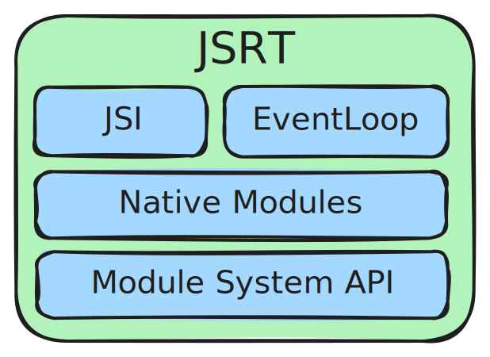

# Higs

An experimental ECMAScript (JS) Runtime written in modern C++20 (and perhaps Swift in the future).

Built on top of JSI (JavaScript Interface) and [Folly](https://github.com/facebook/folly) framework (also for
eventloop).

Uses [Hermes](https://github.com/facebook/hermes) as default JavaScript engine.

> [!WARNING]
>
> Project is in early development state, acting as a PoC. You shouldn't use it yet.

## Why?

- Run ReactNative code headless, mostly for testing
- Experiment with React Native Runtime interface shape (JSRT)
- Hermes Engine deserves JS runtime
- Attempt to learn folly and hermes internals.

# Overview

## Packages

### JSRT

An attempt to shape an Abstract Interface for JavaScript Runtime.

While JSI tries to abstract away JavaScript engines, JSRT tries to do the same with JS Runtimes. JSRT tries to cover:

- Eventloop & concurrent execution
- Module resolving and loading interface
- Native extensions (C++ only TurboModules)
- Workers

It should be easy to implement interop with NodeAPI in both ways:

- Implement JSRT adapter for NodeAPI, so that any library using JSRT can run on NodeAPI
- Expose JSRT libraries / TurboModules to NodeAPI Environment

### Higs

Runtime implementation, provides implementation of JSRT interface.